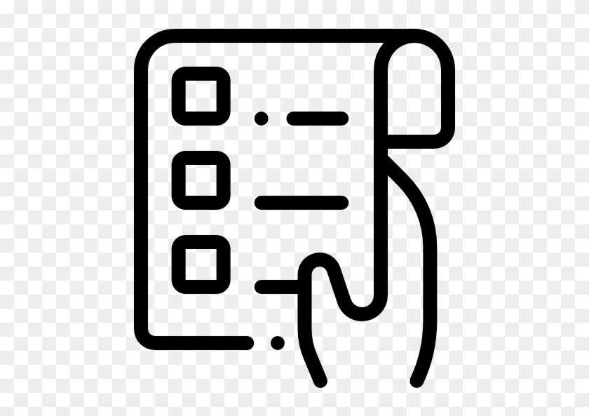

  
   

  <h3><b>Minimalist ToDo-List App</b></h3>
  
This is a simple minimalist ToDo App which you can use to track your daily pending tasks.

# 📗 Table of Contents

- [📖 About the Project](#about-project)
  - [🛠 Built With](#built-with)
    - [Tech Stack](#tech-stack)
    - [Key Features](#key-features)
  - [🚀 Live Demo](#live-demo)
- [💻 Getting Started](#getting-started)
  - [👥 Authors](#authors)
- [🔭 Future Features](#future-features)
- [🤝 Contributing](#contributing)
- [⭐️ Show your support](#support)
- [❓ FAQ](#faq)
- [📝 License](#license)

# 📖 [Minimalist ToDo List] 

**[Minimalist ToDo-List]** is an App that you can use to track your daily tasks.

## 🛠 Built With 

### Tech Stack 

  <ul>
    <li><a href="https://developer.mozilla.org/en-US/docs/Web/HTML">HTML</a></li>
    <li><a href="https://developer.mozilla.org/en-US/docs/Web/CSS">CSS</a></li>
    <li><a href="https://developer.mozilla.org/en-US/docs/Web/JavaScript">Javascript</a></li>
    <li><a href="https://webpack.js.org/">WebPack</a></li>
  </ul>

### Key Features 

- **Extensive DOM Manipulation for Adding/Deleting tasks from the list.**
- **Dinamically adds tasks at loading.**
- **Mark a task as done.**
- **Delete a task.**
- **Delete all your completed tasks at once.**

(<a href="#readme-top">back to top</a>)

## 🚀 Live Demo 

- [Minimalist ToDo-List - Live Demo](https://luigirazum.github.io/mv-mintodolist/)

(<a href="#readme-top">back to top</a>)

## 💻 Getting Started 

To get a local copy up and running, follow these steps:

- [ ] Navigate to the button on the top right green "code" button.
- [ ] In the drop down menu choose "Download Zip".
- [ ] After extracting the files, you'll have my project on your local machine.

(<a href="#readme-top">back to top</a>)

## 👥 Authors 

👨‍💻 Luis Zubia

- GitHub: [@luigirazum](https://github.com/luigirazum)
- Twitter: [@LuigiRazum](https://twitter.com/LuigiRazum)
- LinkedIn: [Luis Raul Zubia Maciel](https://linkedin.com/in/luiszubia)

(<a href="#readme-top">back to top</a>)

## 🔭 Future Features 

- [ ] **Reorder the list, dragging the list items.**

(<a href="#readme-top">back to top</a>)

## 🤝 Contributing 

In order to improve this project, contributions, issues, and feature requests are welcome!

Feel free to check the [issues page](../../issues/).

(<a href="#readme-top">back to top</a>)

## ⭐️ Show your support 

I really enjoyed making this project, so, if you like it, I appreciate your support giving me a ⭐.

(<a href="#readme-top">back to top</a>)

## ❓ FAQ 

- **Why should you use this project?**

  - Because you can realize what you can achieve using this amazing tool.

- **Why did I make this project?**

  - In order to start putting in practice the use of WebPack to create better projects.

(<a href="#readme-top">back to top</a>)

## 📝 License 

This project is [MIT](./LICENSE) licensed.

_NOTE: we recommend using the [MIT license](https://choosealicense.com/licenses/mit/) - you can set it up quickly by [using templates available on GitHub](https://docs.github.com/en/communities/setting-up-your-project-for-healthy-contributions/adding-a-license-to-a-repository). You can also use [any other license](https://choosealicense.com/licenses/) if you wish._

(<a href="#readme-top">back to top</a>)

